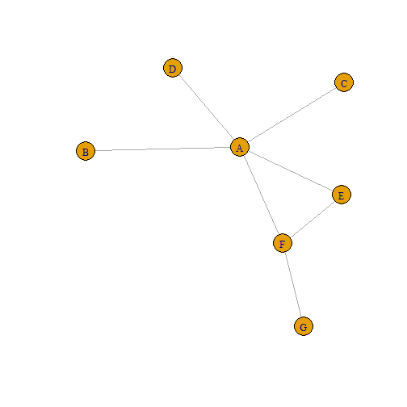

Social Network Analysis
========================================================
<hr>
author: Sebnem Er
date: 
autosize: true

Structure of the Workshop
========================================================
<ul>
  <li>What is social network analysis?
    <ul>
      <li>foundational concepts of social networks: graph theory</li>
    </ul>
  <li>Types of social network analysis.
    <ul>
      <li>visualization of social networks,</li>
      <li>descriptive analysis of social networks,</li>
      <li>statistical network models.</li>
    </ul>
  <li>Network data: collection and applications in South Africa.
  <li>Packages.
</ul>
 
- 

Simple example -  Edge list with no information
========================================================


```r
library(igraph)
# example in data frame
a=c("A","A","A","A","A","E","F")
b=c("B","C","D","E","F","F","G")
df = cbind(a,b)
df = as.data.frame(df)
df
```

```
  a b
1 A B
2 A C
3 A D
4 A E
5 A F
6 E F
7 F G
```

Slide With Plot
========================================================


```
7 x 7 sparse Matrix of class "dgCMatrix"
  A B C D E F G
A . 1 1 1 1 1 .
B 1 . . . . . .
C 1 . . . . . .
D 1 . . . . . .
E 1 . . . . 1 .
F 1 . . . 1 . 1
G . . . . . 1 .
```

Slide With Plot
========================================================


